# 小云社团小程序的设计与实现

### ⭐ 写在前面
* 🍍 **2021中国高校计算机大赛——微信小程序应用开发赛 参赛作品**
* 🍉**由于时间原因，只完成了大部分**
* 🍊 **鲁东大学**
* 🌽**小组成员：小朱、小闭、小田、小崔**

## 1. 项目介绍
### 1.1 项目背景
* 社团在当今大学生的兴趣发展中占有重要的地位，而且当今大学生有相当一部分的课余时间和兴趣发展都主要集中于社团，社团不仅给当今大学生提供了更多的发展兴趣的途径，而且增进了大学生之间的感情和交流。
* 现在绝大多数社团的管理，和统计，包括社团纳新，人员的统计，活动的安排等，都局限于社团秘书处繁杂的人工统计，人工统计除了浪费时间以外，还存在效率低下，易出错的问题，而且社团活动大都是自己内部的活动，很少存在社团之间的交流合作，尤其是行之相同的社团之间，几乎不存在相互交流学习的机会，此外社团的活动宣传现在大都通过 QQ，微信等社交平台，没有一个相对集中的宣传环境，由于社交平台每天的信息量比较多，所以很容易错过一些有趣的社团活动。
* 当今大学生都至少有一个微信号，微信小程序能够让大家便捷且集中的获取社团信息。

### 1.1 项目简介此平台主要面向当今大学生社团，能有效的解决当前大学社团存在的部分问题，当
* 目前互联网上还没有类似的社团管理和交流的平台，竞争相对较小，而且对促进大学社社团的管理和交流，都有极大的意义。
## 2. 产品设计
### 2.1 功能需求分析
* 登录功能
系统需要有登录功能，在登录模块中，需要微信授权登录，获取基本信息。可在我的主页完善个人信息。
* 添加新社团的功能
用户可以添加自己的社团，在新建社团页面，用户需要完善基本信息、社团简介、社团徽标，输入社团名、联系方式、归属机构，新建社团的用户默认是社团管理
员（会长）。
* 信息修改和管理功能
用户需要有修改个人信息的功能，此外，针对不同职位的用户，需要具有不同的信息修改权限，比如会长具有最高的权限，可以修改社团名称、学校等基本信息，而部长只能管理自己的部门，管理部门人员，干事只具备修改个人信息的权限。
* 管理功能
不同职位的人员具有不同的权限，分别对应会长级、部长级、干事级，会长级别可以管理整个社团的所有人员信息，包括删除和修改部门信息，所有人员的清除，而部长只能管理自己的部门，只对自己的部门人员有删除和添加的权限。
* 活动发布和展示功能
用户需要具有活动发布的功能，当社团有新活动时，社团用户可以发布社团活动，活动包括名称、主要活动内容等信息。活动发布后，帖子内部会有“热度值”的属性，热度较高的活动会在小云社团主页展示。
* 社团纳新报名功能
社团应该具有报名和审核的功能，用户可以查看自己学校有哪些社团，然后向自己中意的社团提交报名表，社团管理员可以查看报名表，并且做出同意或拒绝操作，同意后该用户会自动加入该社团。
* 消息提醒功能
系统应该具有消息提醒功能，某些需要用户注意的消息，需要在消息通知里做出提醒。

### 2.1 用户需求分析
* 用户进入主页时，应该看到小程序的特色信息，从而对该小程序有一个大致的了解。
* 主页应该具有热门活动展示，以便所有用户能够看到，从而起到一个宣传的效果。
* 用户可以方便的查看各个社团和活动的信息，以便进行报名，活动和社团应该具有过滤或搜索功能，以便用户快速的定位自己想要查看的社团和活动。
*  除了查看社团和活动，一般用户登录都是进行进入管理台对社团进行管理，所以应该提供方便的管理台入口。
* 管理台应该有明确的管理操作的分类，以便用户方便的找到自己想要进行的操作。
## 3. 系统设计
### 3.1 系统功能模块设计
该系统主要分为 5 个功能模块，每个模块下面都有该模块所对应的功能。每个模块在后台分包单独实现，实现模块之间的解耦，方便后续修改和重构。
_项目整体设计如图  所示。_

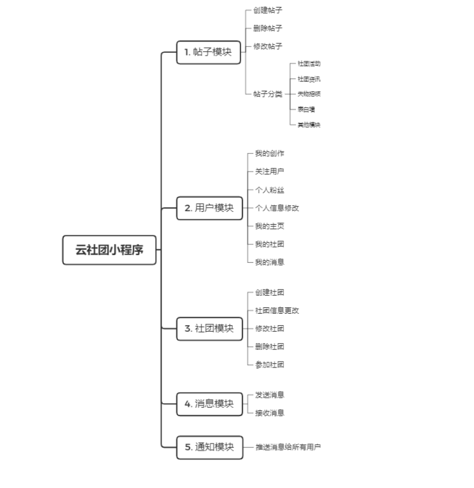

### 3.2 系统数据库设计（使用微信云开发）

#### 3.2.1 用户信息：user

|字段| 类型  | 备注 |
| --- | :--- | :---: |
| _id |  | 自动生成 |
| username | string | 用户名 |
| gender | number | 性别男：1女：2未知:0 |
| province | string | 省{code:代码，name：名称} |
| city | string | 市{code:代码，name：名称} |
| district | string | 区{code:代码，name：名称} |
| univercity | string | 大学{code:代码，name：名称} |
| associations | array | 所在社团的id列表 |
| brief | string | 个人简介 |
| fans | array | 粉丝id列表 |
| follow | array | 关注id列表 |
| works | array | 用户的帖子id列表 |
| collections | array | 收藏帖子id列表 |
| avatar_url | string | 头像的url |
| bg_url | string | 主页背景图片的url |
| openid | string | 唯一标识微信用户的openid |
| collections | array | 收藏的帖子id列表 |
| create_time | Dat | e数据创建时间 |

#### 3.2.2 消息：message

|字段| 类型  | 备注 |
| --- | :--- | :---: |
| _id 自动生成 | |
| sender | string | 发送者 id |
| receiver | string | 接收者 id |
| content | string | 消息内容 |
| create_time | Date| 创建时间 |

#### 3.2.3 帖子：post

|字段| 类型  | 备注 |
| --- | :--- | :---: |
| _id | | 自动生成 |
| title | string |  帖子标题 |
| content | Object |  帖子内容 html 格式{html, post_file_maps } |
| author_id | string |  作者 id |
| view_count | number | 阅读次数 |
| like_count | number | 点赞数量 |
| type | string |  帖子类型 固定值 normal notice activity（与分类表的同步） |
| asso_id | string |  相关社团 id，无则 字符串 null |
| part_id | string |  帖子板块 id |
| create_time | Date | 创建时间 |

#### 3.2.4 评论：comment

|字段| 类型  | 备注 |
| --- | :--- | :---: |
| _id | | 自动生成 |
| title | string | 帖子标题 |
| content | string | 帖子内容 |
| img_list | array | 帖子配图列表 元素最多 9 个 |
| author_id | string | 作者 id |
| view_count | number | 阅读次数 |
| create_time | Date | 创建时间 |

#### 3.2.5 社团信息表：association

|字段| 类型  | 备注 |
| --- | :--- | :---: |
|_id | | 自动生成|
|name | string |  社团名|
|brief | Object | 社团简介 html 格式{html, brief_file_maps }|
|belong | string |  社团归属|
|contact | string |  联系方式|
|members | array | 成员 id 列表|
|posts | array | 有关社团的帖子 id 列表|
|bgc_file_id | string |  背景图 url|
|icon_file_id |Id 值| 社团图标 url|
|owner_id | id | 创建者 id|
|create_time |Date | 创建时间|

#### 3.2.6 社团成员：asso_member

|字段| 类型  | 备注 |
| --- | :--- | :---: |
|_id | |自动生成|
|user_id | string | 对应的 user 表 id|
|is_admin | bool | true：是管理员 false：不是管理员|
|position | string | 社团职位|

#### 3.2.7 分类表：category

|字段| 类型  | 备注 |
| --- | :--- | :---: |
|_id | | 自动生成|
|name | string | 分类名称|
|asso | bool | true：社团相关 false：非社团相关|
|type | string | 社团相关的类型：notice 社团资讯 activity 社团活动 normal 社团无关|
|create_time | Date | 创建时间|

## 4. 系统测试
### 4.1 主页

    
    

### 4.2 广场

    
    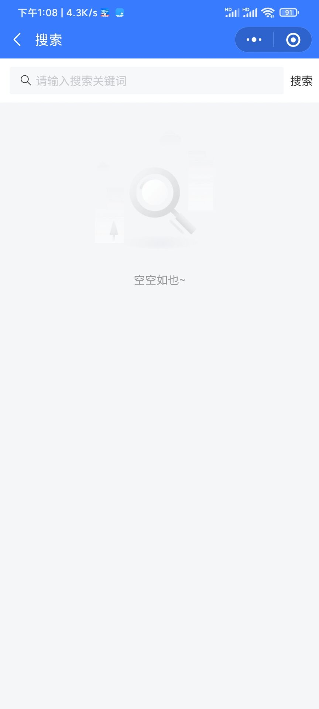

### 4.3 我的

 

### 4.4 个人信息展示

    
    

### 4.5 社团相关

    
    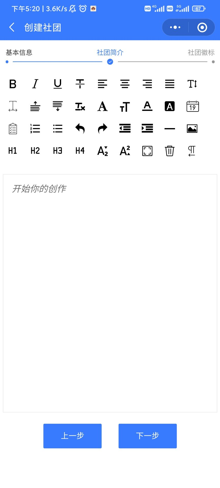
    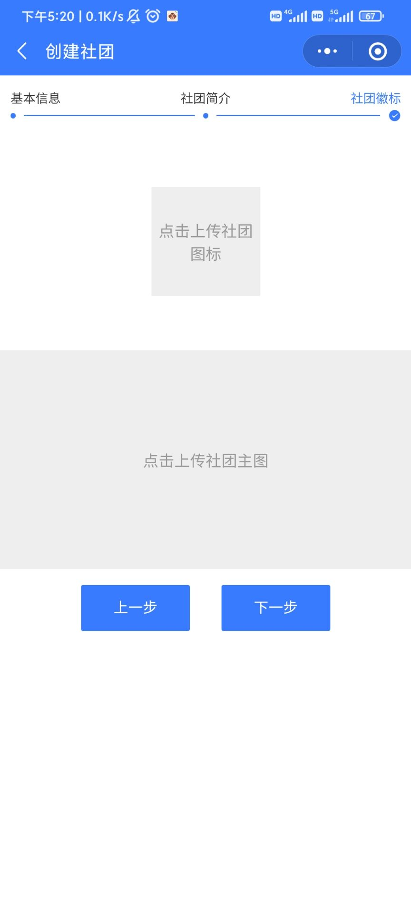
    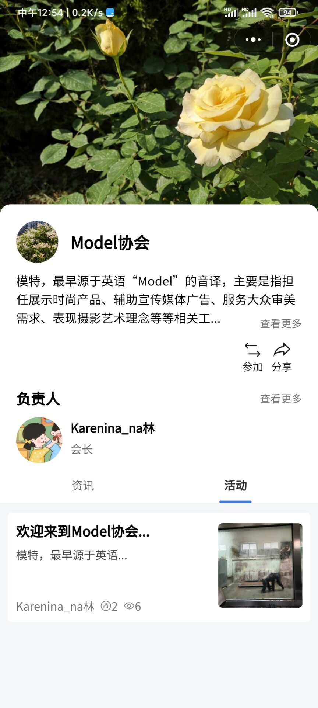

### 4.6 文章相关

    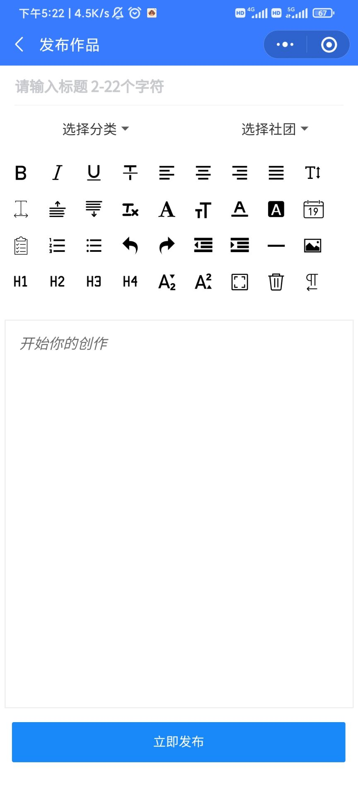
    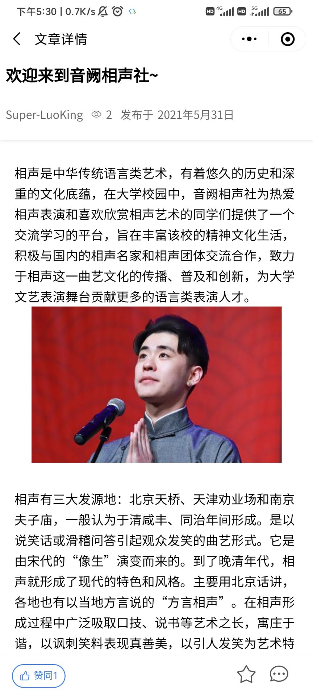
    

### 4.6 其它

    
    
    
    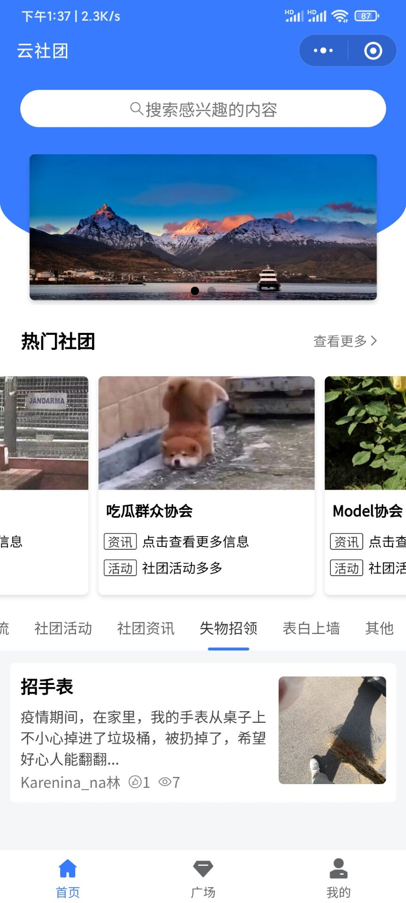
    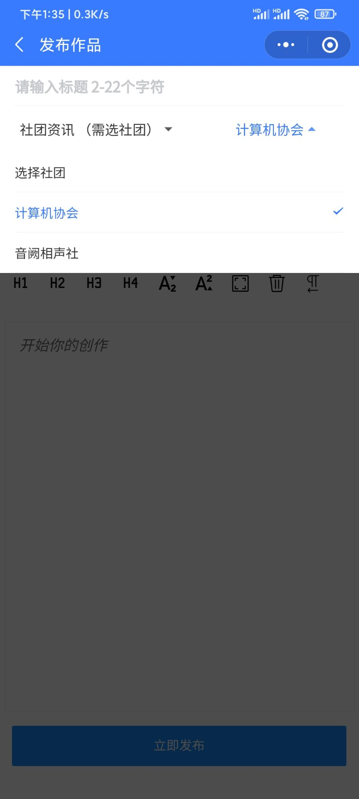
    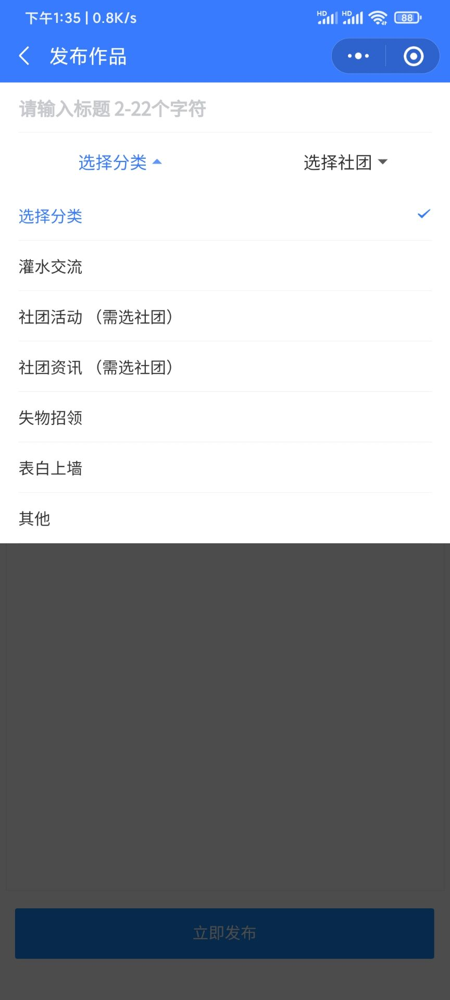
    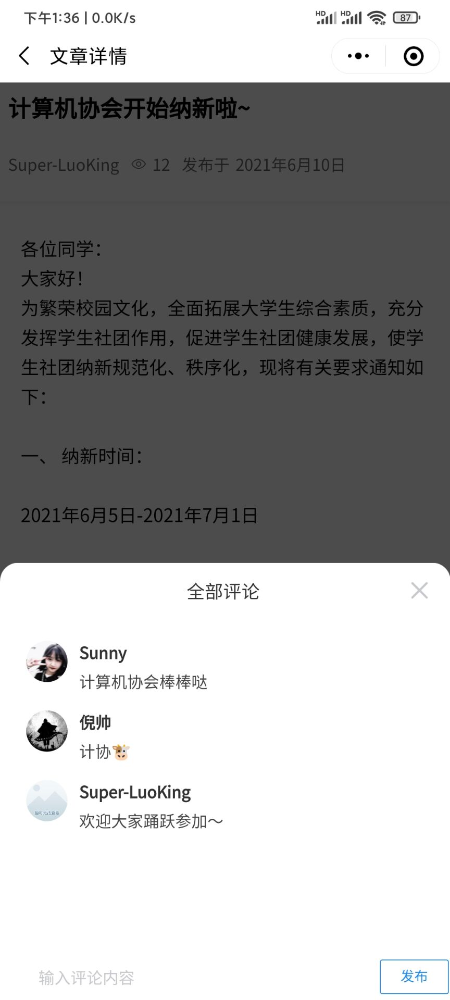
    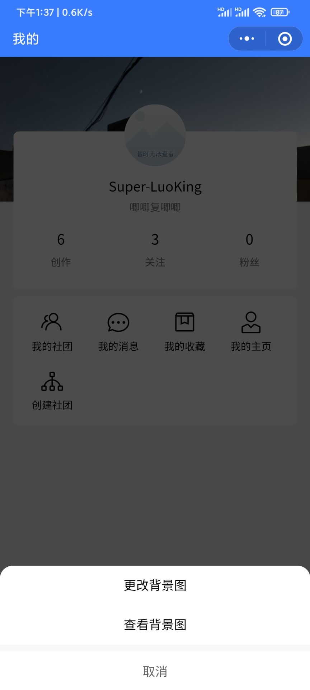

## 5. 第三方库引用

* Vant Weap 组件库 
https://vant-contrib.gitee.io/vant-weapp/#/home 
* 微信小程序 HTML 富文本解析
https://github.com/pacochan/wxParser 
* image-cropper
https://github.com/1977474741/image-cropper
* regeneratorRuntime
https://github.com/xubaifuCode/regeneratorRuntime